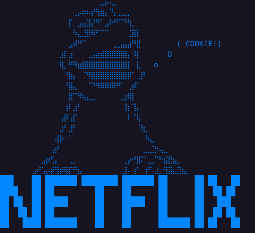

# Netflix Cookie Monster
## Check Netflix Login cookies

In order to use the program correctly, place a single or multiple cookie files in the 'cookies' folder.

These files will need to adhere to the 'Netscape Cookie File Format', or a text file (*.txt) with a single
line for each cookie object. The lines look something like:

.netflix.com TRUE   /   FALSE   1700000000  nfvdid  (long string)

(those are tabs, represented in an escape sequences as '\t')

The program will then check these files depending on the following user options:

1) Check a single cookie. Enter the file name of the cookie, which must be placed in the 'cookies' folder and
end in '*.txt'. The file must be a valid 'Netscape Cookie File Format' file, without extra spaces or extra characters
a IndexError might occur).

2) Check multiple cookies. This can of course be chosen for single cookies too. Always make sure your cookies are valid.

3) Acquire Cookie From Session. Enter your login details, and a cookie in json format will be created and placed in the
'valid_cookies' folder

4) Check Cookie Validity. This is a double check, to see if the json cookies created are usable.
The program will then check single/multiple cookies, and inform the user whether logins are valid.
Valid logins are stored in the appropriate folder.

Launch preferably in a Linux terminal, although the script was created in Windows and should work fine (apart from botched escape sequences in powershell...).